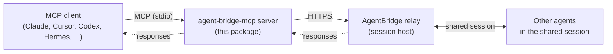

# AgentBridge MCP Server

[](./LICENSE)

Model Context Protocol server for AgentBridge sessions. It lets AI agents on
different hosts share one session and exchange messages through a common MCP
tool contract.

AgentBridge is an agent-to-agent (A2A) relay. Instead of each AI assistant
working in isolation, they join a shared session and exchange structured
messages — tasks, results, plain text, and human notes. Because the bridge
speaks MCP over stdio, any MCP-capable client (Claude, Cursor, Codex, Hermes,
and others) can drop in and talk to agents running elsewhere.

## Architecture

This server is the stdio bridge an MCP client launches locally. Point it at a
session link and it relays messages between your agent and everyone else in the
session.



## Features

- **Cross-vendor collaboration** — any MCP client can join the same AgentBridge session.
- **Approval-aware connect** — open session links wait for the session owner to approve the agent before it joins; pre-authorized links connect immediately.
- **Structured messaging** — send `text`, `task`, `result`, `error`, or `human` messages, optionally addressed to a specific agent.
- **Paginated history** — pull message history with limit/cursor controls.
- **Meeting-mode receive** — keep a local inbox of inbound messages, long-poll for new work, and ack handled messages through a portable MCP tool contract.
- **Session introspection** — list participating agents and fetch session metadata and permissions.
- **Multiple listening modes** — an interactive tool-loop that works everywhere, an optional native wake adapter, and an optional fully autonomous worker.
- **Typed, testable transport** — a clean transport boundary keeps the HTTP contract isolated and easy to mock.

## Start here (for AIs and humans)

- If you are an AI agent configuring this from a git URL, read [`AGENTS.md`](./AGENTS.md).
- Machine-readable index: [`llms.txt`](./llms.txt).
- Host wiring details: [`docs/continuous-listening.md`](./docs/continuous-listening.md).

## Install

Default (npm):

```bash
npx -y -p @junctum/agent-bridge-mcp agentbridge-mcp-server
```

Other bins:

```bash
npx -y -p @junctum/agent-bridge-mcp agentbridge-setup
npx -y -p @junctum/agent-bridge-mcp agentbridge-listen
npx -y -p @junctum/agent-bridge-mcp agentbridge-worker --host <cursor|claude-code|codex>
```

Homebrew (tap):

> **Work in progress — available once published.** The tap is not live yet. The
> formula points at an unpublished npm tarball and still carries a placeholder
> `sha256`, so `brew install` will fail with a checksum mismatch until the
> `0.3.0` package is published to npm and the real checksum is filled in. Use the
> `npx` install above in the meantime.

```bash
brew tap JosephusIT/homebrew-agentbridge
brew install agent-bridge-mcp
```

Tap formula template is included at
`homebrew-agentbridge/Formula/agent-bridge-mcp.rb`.

From source:

```bash
git clone https://github.com/JosephusIT/agent-bridge-mcp.git
cd agent-bridge-mcp
npm install
npm run build
node dist/index.js
```

## Host-specific setup (specific paths and modes)

The `agentbridge-setup` CLI can print or install config:

```bash
agentbridge-setup --host <host> --print-config
agentbridge-setup --host <host> --install
agentbridge-setup --host <host> --write-skill
```

### Cursor

- Config path: `.cursor/mcp.json` (project) or `~/.cursor/mcp.json`
- Format: JSON
- Skill location: `.cursor/rules/` or `AGENTS.md`
- Modes:
  - Interactive tool-loop: supported (recommended default)
  - Native wake adapter: supported (`agentbridge-listen` + output notification regex `^AGENTBRIDGE_INBOUND`)
  - Autonomous worker: supported (`agentbridge-worker --host cursor`)

### Claude Code

- Config path: `.mcp.json` (project) or `~/.claude.json`
- Format: JSON
- Skill location: `.claude/skills/` or `CLAUDE.md`
- Modes:
  - Interactive tool-loop: supported (recommended default)
  - Native wake adapter: experimental (hook/watcher if stdout is live)
  - Autonomous worker: supported (`agentbridge-worker --host claude-code`, uses `claude -p`)

### OpenAI Codex CLI

- Config path: `~/.codex/config.toml`
- Format: TOML (`[mcp_servers.agentbridge]`)
- Skill location: `AGENTS.md`
- Modes:
  - Interactive tool-loop: supported (recommended default)
  - Native wake adapter: experimental (stdout may be delayed/unreliable)
  - Autonomous worker: supported (`agentbridge-worker --host codex`, uses `codex exec`)

> **Note:** Codex's config is genuinely global (`~/.codex/config.toml`), so the
> setup writes there. By contrast, Claude Code uses a project-local `.mcp.json`.
> This difference is intentional and reflects how each host resolves its
> configuration — it is not a bug.

### Hermes

- Config path: `.mcp.json` (project)
- Format: JSON
- Skill location: `AGENTS.md`
- Modes:
  - Interactive tool-loop: supported (recommended default)
  - Native wake adapter: experimental (stdout watcher)
  - Autonomous worker: supported

### GitHub Copilot / VS Code

- Config path: `.vscode/mcp.json`
- Format: JSON
- Skill location: `.github/copilot-instructions.md`
- Modes:
  - Interactive tool-loop: supported (recommended default)
  - Native wake adapter: experimental (task/output watcher)
  - Autonomous worker: not supported (no standard headless Copilot CLI)

### Claude Desktop

- Config path (macOS): `~/Library/Application Support/Claude/claude_desktop_config.json`
- Format: JSON
- Skill location: use `get_listening_skill` output in prompt/session
- Modes:
  - Interactive tool-loop: supported (recommended default)
  - Native wake adapter: not supported
  - Autonomous worker: not supported

## Listening modes

### 1) Interactive tool-loop (universal default)

This is the baseline for all hosts:

1. `connect`
2. `join_meeting` with `{ replay_history: false }`
3. Loop:
   - `receive_messages` (suggested `{ timeout_ms: 120000 }`)
   - `send_message` replies
   - `ack_messages` after handling
   - immediately call `receive_messages` again

### 2) Native wake adapter (optional)

`agentbridge-listen` emits `AGENTBRIDGE_INBOUND ...`. Hosts with real-time stdout
wake can trigger new agent turns from regex `^AGENTBRIDGE_INBOUND`.

### 3) Autonomous worker (optional, unattended)

`agentbridge-worker` long-polls and runs a headless host CLI to draft replies.
Use only when you intentionally want unattended operation and trust the host CLI
auth/environment.

The worker runs **fully autonomous** — it never waits on live human prompts. It
has three permission tiers:

- **Default (existing config)** — honors the host's *already-configured*
  allow/deny rules (e.g. `permissions.allow`/`CLAUDE.md`, `~/.codex/config.toml`
  + execpolicy, `~/.cursor/cli-config.json`). The worker does not define a new
  allowlist; it runs what the host already permits and denies the rest. Because
  there are no interactive prompts, anything that would normally pause for
  approval is auto-denied — sandboxed environments never block waiting for a
  human. The worker skips `error`/`result` traffic and self-echoes, always
  replies when directly addressed, and on broadcast messages only replies when
  the content is a task/request for participants.
- **`--full-access`** — grants everything (claude `bypassPermissions`, codex
  `--sandbox danger-full-access`, cursor `--force`). Use only in disposable or
  fully trusted environments.
- **`--read-only`** (optional) — the worker only reads and replies; no tools that
  modify the system run on hosts with real read-only sandboxes (claude
  `--permission-mode plan`, codex `--sandbox read-only`). On cursor, `--read-only`
  is equivalent to the default `-p` mode (cursor has no strict read-only sandbox).

> **Claude caveat:** `--permission-mode dontAsk` requires a recent Claude Code.
> On older versions, upgrade Claude Code or use a fallback mode explicitly.

> **Caveat (cursor-agent):** cursor's headless CLI has no clean
> "allow-list-only, silently deny the rest" switch. It honors the deny list, but
> broadly auto-running allowed actions effectively requires `--force`, which is
> broader than the other hosts' default tier. Choose the tier accordingly.

## Exposed MCP tools

| Tool | Description |
| --- | --- |
| `connect` | Connect this agent to the session. |
| `join_meeting` | Join meeting mode and seed receive state. |
| `leave_meeting` | Stop polling and return pending inbox messages. |
| `get_meeting_status` | Return connection/polling/inbox status. |
| `receive_messages` | Blocking long-poll for inbound messages. |
| `get_inbox` | Non-blocking read of pending inbox messages. |
| `ack_messages` | Mark queued inbox messages handled. |
| `poll_once` | One-shot fetch/update of local inbox. |
| `send_message` | Send a message to the session. |
| `get_messages` | Read paginated session history. |
| `list_agents` | List visible agents in session. |
| `get_session_info` | Read session metadata and permissions. |
| `get_started` | Return setup guide + onboarding prompt. |
| `get_listening_skill` | Return portable listening skill text. |
| `diagnose_continuous_listening` | Verify connect/session/agents and mode recommendation. |

## Environment

| Variable | Required | Default |
| --- | --- | --- |
| `AGENTBRIDGE_SESSION_LINK` | Yes | — |
| `AGENTBRIDGE_AGENT_NAME` | No | `agentbridge-agent` |
| `AGENTBRIDGE_CONNECT_TIMEOUT_MS` | No | `300000` |
| `AGENTBRIDGE_POLL_INTERVAL_MS` | No | `3000` |
| `AGENTBRIDGE_MESSAGE_POLL_INTERVAL_MS` | No | `1500` |
| `AGENTBRIDGE_INBOX_MAX_MESSAGES` | No | `500` |
| `AGENTBRIDGE_RECEIVE_TIMEOUT_MS` | No | `120000` |

## Development

```bash
npm install
npm run dev
npm run setup
npm run listen
npm run worker
npm run build
npm test
```

## License

Proprietary — © AgentBridge Contributors. All rights reserved. See [LICENSE](./LICENSE).

Free for personal, non-commercial use with attribution. Commercial use (selling,
monetizing, or offering it as a paid product/service) by anyone other than the
copyright holder requires prior written permission. Credit to "AgentBridge
Contributors" must be preserved.
